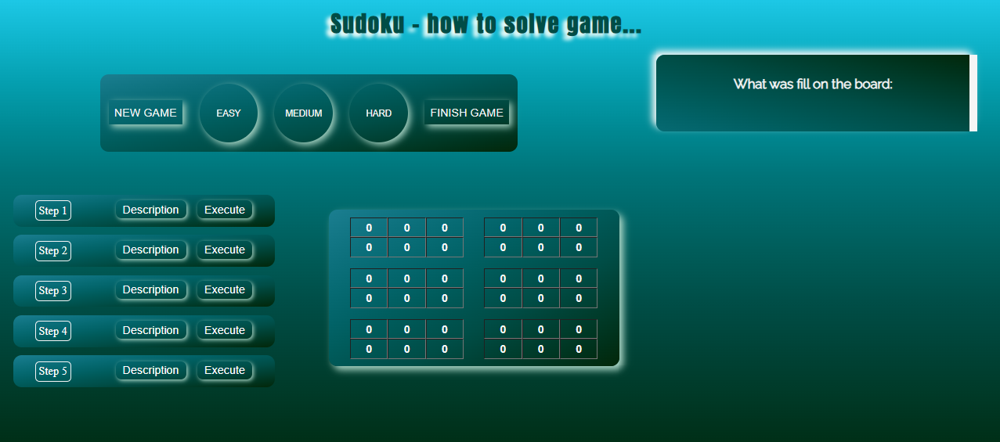

# The page shows you how to resolve Sudoku game!  

# Content of project

- [General info](#general-info)
- [Technologies](#technologies)
- [Installation](#installation)
- [Application view](#application-view)
- [To update](#to-update)
- [Tutorials](#tutorials)
- [Summary of the project](#summary-of-the-project)
- [Contact](#contact)

## General info

This project is showing how to resolve Sudoku game. In this game we have to fill missing digit in empty fields.
The classic Sudoku has gameboard 9x9. My project contains board which size is 6x6. You have to fill digit in empty field but this field must meet two conditions in below:

1. Digit can't be in "minimatrix", which contains this empty field. ( minimatrix has yellow border):
   
2. Digit can't be in single row or column, which contains this empty field.
   

   For this example you have to fill digit "6" in field, which is shown by arrow. Any other digit isn't right in this field.

My project has three levels of difficulty. If you don't know what number fill the next one, you can use the one of five hint ( steps ).
You can expand the description, when you clicked in "description" button.

On the right is the screen will present, what dighit was filled on the board.
You can start game, when you clicked one of three buttons: EASY, MEDIUM, HARD.
The button "finish game" can solve sudoku immediately and display every step on the screen on the right.

## Technologies

<ul>
<li>PHP</li>
<li>HTML</li>
<li>JAVASCRIPT</li>
<li>CSS</li>
<li>SCSS</li>
</ul>

## Installation

## Application view

 <b>home</b> 

  This image shows home page. This page contains header, menu and five articles, which are newest on this page.  

## To update

## Tutorials

To create this page I used a dozen tutorials. A few from of them are below:

<ul>
<li>https://www.youtube.com/watch?v=n-cW9HzpnRk&t=3449s</li>
<li>https://www.youtube.com/watch?v=YpB1I3wgDgQ</li>
<li>https://www.youtube.com/watch?v=L19WO4jfzMM&t=1020s</li>
<li>https://www.youtube.com/watch?v=HaDYXVqbJcw&t=2s</li>
<li>https://www.youtube.com/watch?v=q0KJEmMlG20&t=236s</li>
<li>https://www.youtube.com/watch?v=o_GnXwio5Hs</li>
</ul>

## Summary of the project

## Contact

<ul>
<li> My github: https://github.com/AlbertB93 </li>
<li>E-mail to me:  bercik93@interia.eu </li>
</ul>
