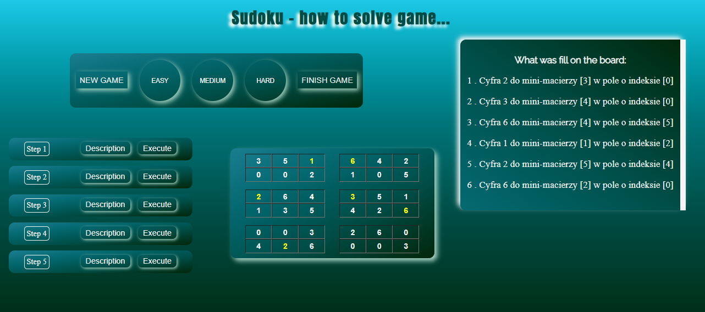

# How to solve Sudoku game?  

# Content of project

- [General info](#general-info)
- [Technologies](#technologies)
- [Installation](#installation)
- [Application view](#application-view)
- [To update](#to-update)
- [Tutorials](#tutorials)
- [Summary of the project](#summary-of-the-project)
- [Contact](#contact)

## General info

This project is showing how to resolve Sudoku game. In this game we have to fill missing digit in empty fields.
The classic Sudoku has gameboard 9x9. My project contains board which size is 6x6. You have to fill digit in empty field but this field must meet two conditions in below:

1. Digit can't be in "minimatrix", which contains this empty field. ( minimatrix has yellow border):
   
2. Digit can't be in single row or column, which contains this empty field.
   

   For this example you have to fill digit "6" in field, which is shown by arrow. Any other digit isn't right in this field.

My project has three levels of difficulty. If you don't know what number fill the next one, you can use the one of five hint ( steps ).
You can expand the description, when you clicked in "description" button.

On the right is the screen will present, what dighit was filled on the board.
You can start game, when you clicked one of three buttons: EASY, MEDIUM, HARD.
The button "finish game" can solve sudoku immediately and display every step on the screen on the right.

## Technologies

<ul>
<li>VUE 3</li>
<li>JAVASCRIPT</li>
<li>HTML</li>
<li>CSS</li>
<li>SCSS</li>
</ul>

## Installation

Installtion VUE 3  
https://vuejs.org/guide/quick-start.html

TUTAJ MUSIMY TEŻ DODAĆ JAK URUCHOMIĆ APLIKACJĘ

## Application view

 <b>Home</b> 

  This image shows home page.  

 <b>Step description</b> 

  This image shows decrption for step "1" and step "3"  

 <b>Game after a few steps executed</b> 

  This image shows game, when a few digits have already been filled in the empty fields.  

## To update

<ul>
<li>Code review to optymize a few functions to keeping less space in a whole project </li>
<li>Extend game board to size 9x9</li>
<li>Split project to more components</li>
</ul>

## Tutorials

To create this page I used a dozen tutorials. A few from of them are below:

<ul>
<li>https://www.youtube.com/watch?v=n-cW9HzpnRk&t=3449s</li>
<li>https://www.youtube.com/watch?v=YpB1I3wgDgQ</li>
<li>https://www.youtube.com/watch?v=L19WO4jfzMM&t=1020s</li>
<li>https://www.youtube.com/watch?v=HaDYXVqbJcw&t=2s</li>
<li>https://www.youtube.com/watch?v=q0KJEmMlG20&t=236s</li>
<li>https://www.youtube.com/watch?v=o_GnXwio5Hs</li>
</ul>

## Summary of the project

The prototype this project was created a 2-3 years ago in Java. A few months ago I want to create some graphic module for it.
At the beginning I started from HTML and CSS + JS. I don't have a lot of time so I change this project step by step at different time intervals.
I started with one game level - easy and developed this project with each next example - adding more steps to solve every board in my project (3 x 10 examples with three level of difficult)
I want to modify project to VUE. After some time I know that, simplest is create some project from beginning in language with use framework than modifying project from other language to another framework / language. Therefore, I know this project has a few defects so my next project will be created from beginning in Vue and React.

## Contact

<ul>
<li> My github: https://github.com/AlbertB93 </li>
<li>E-mail to me:  bercik93@interia.eu </li>
</ul>
